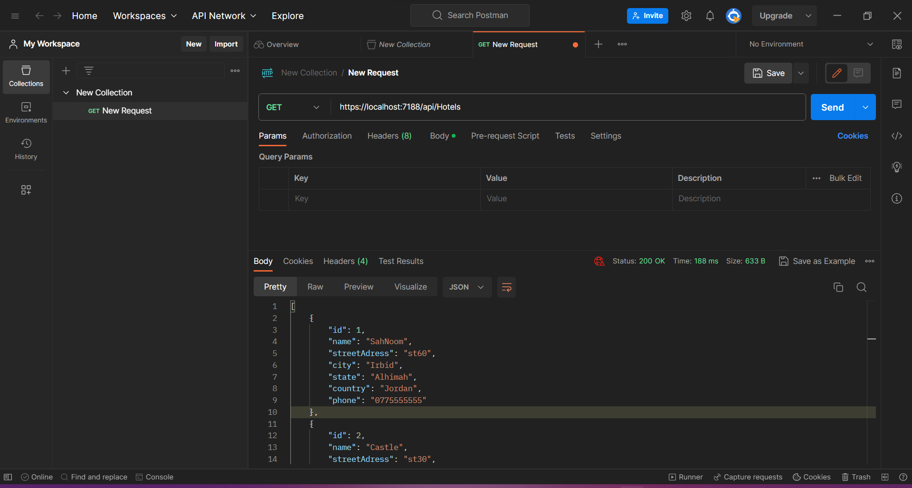
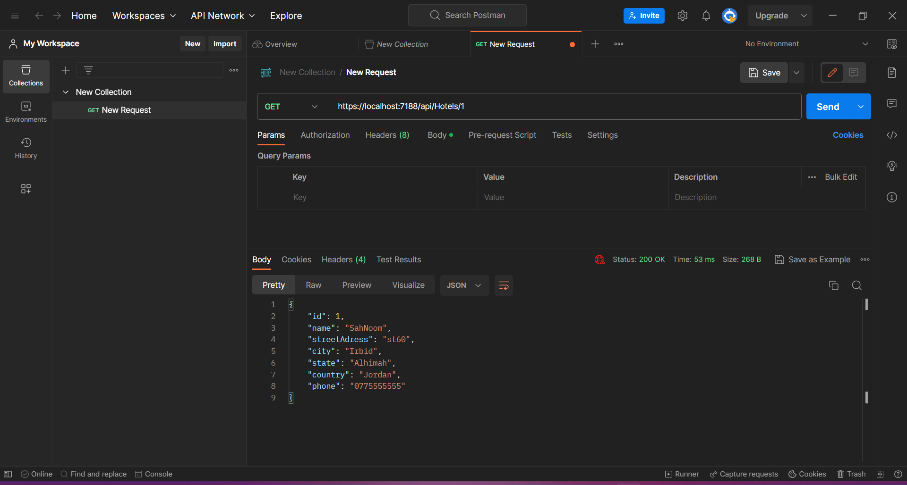
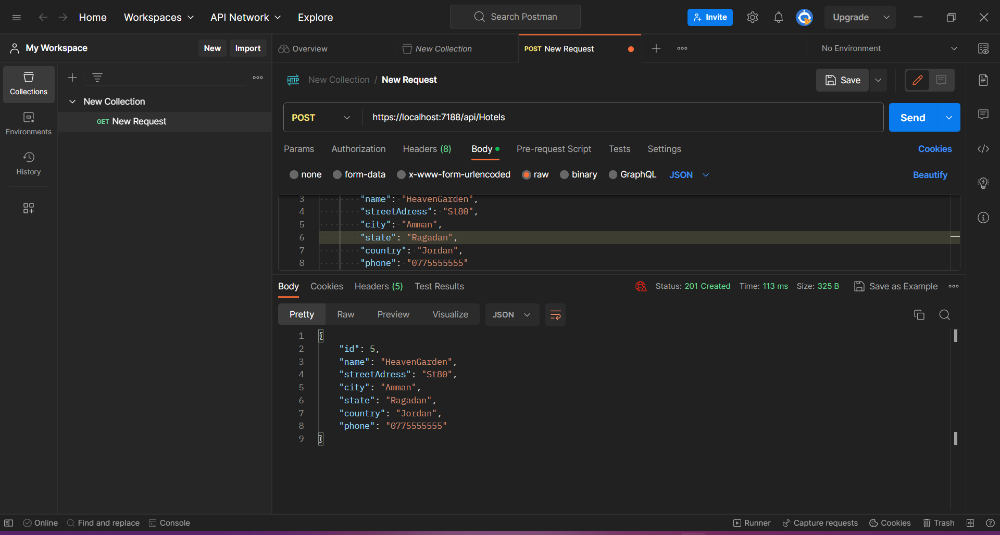
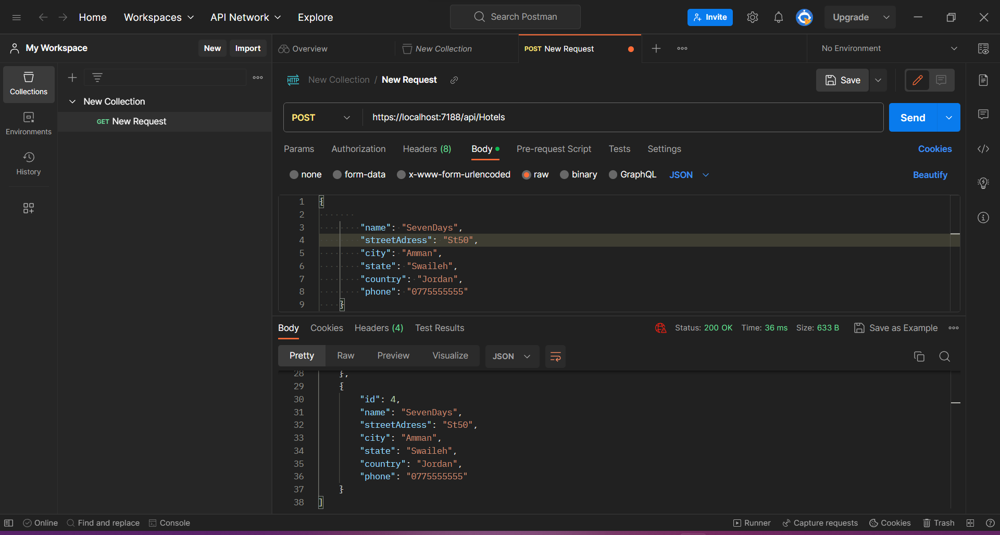
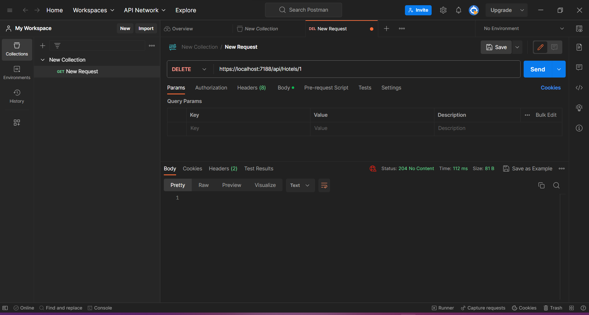
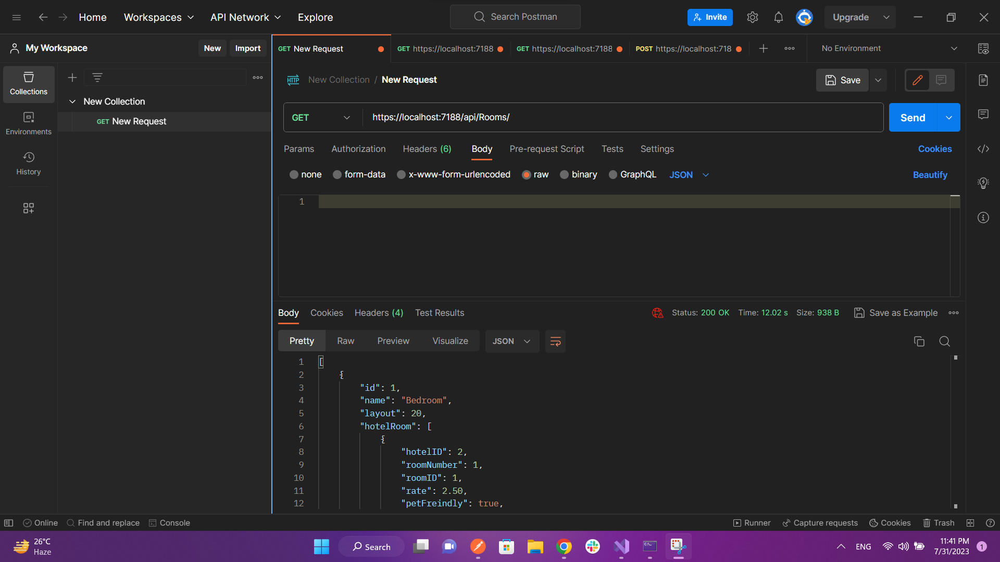
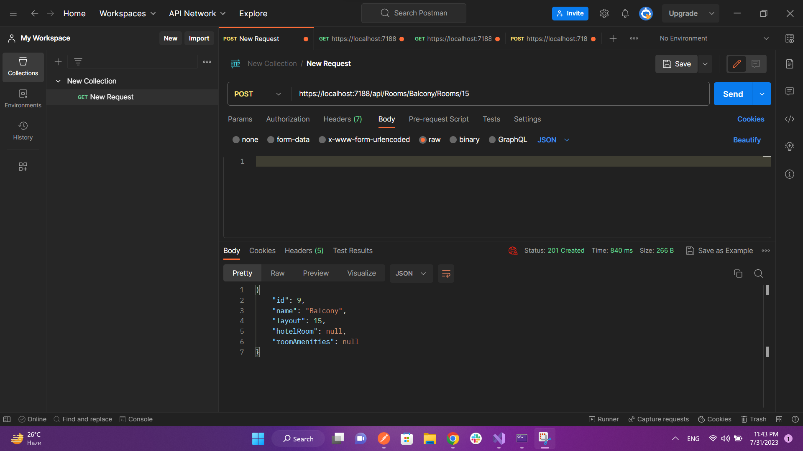
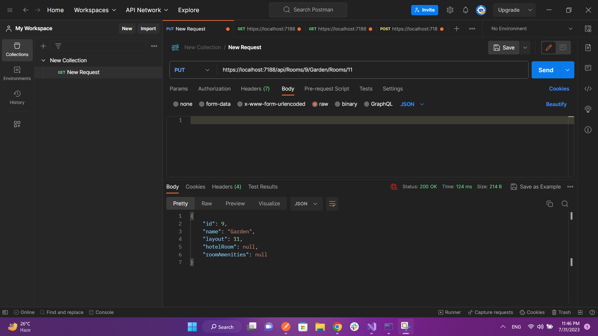
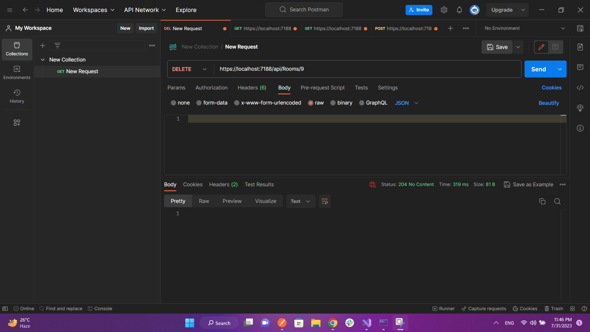

# Async__Inn

For the **Hotel** entity, the table adds three hotels with their respective names, street addresses, cities, countries, phone numbers, and states.

For the **Room** entity, the table adds three rooms with their names and layout sizes.

For the **Amenity** entity, the table adds three amenities with their names.

## architecture
3 esstinal models (Hotels, Rooms, and Amenities).

3 Interfaces for every model.

service for each of the controllers that implement the appropriate interface.

CRUD operations for evry class.

I Update the Controller to use the appropriate method from the interface rather than the DBContext directly.

## API Requests (CRUD)

## Navigation properties
we add a NP to the previos entity so it has an access to each other values.

And here is the CRUD operations after adding NP:

Get:

Post:

Put:

Delete:
